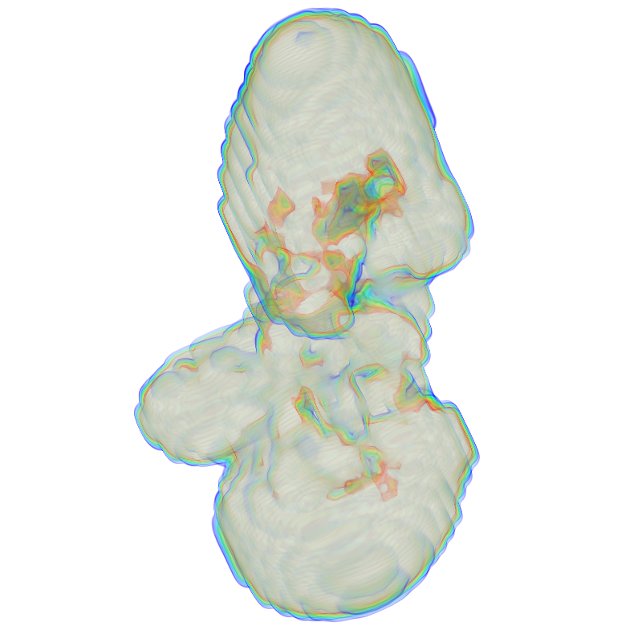
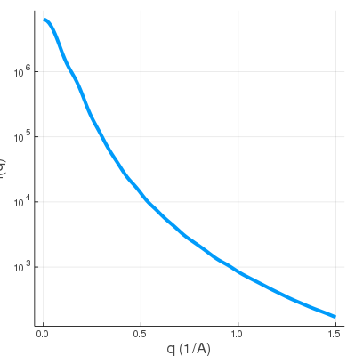
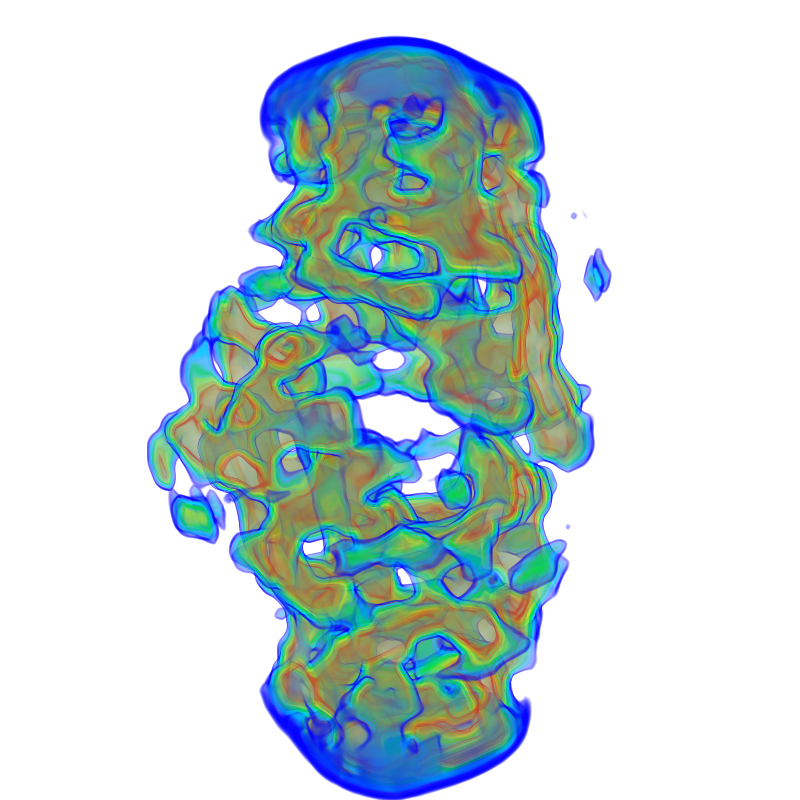
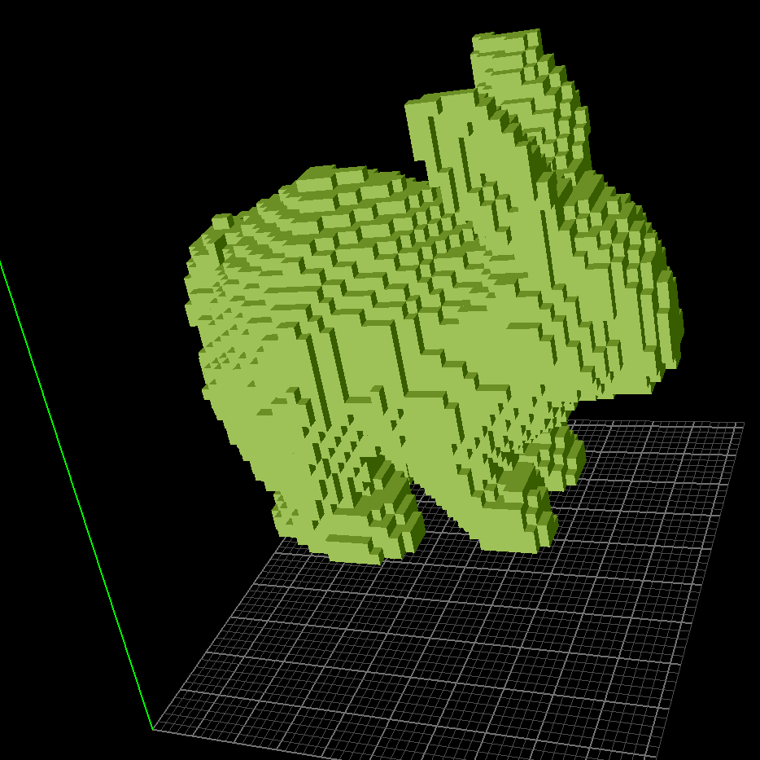
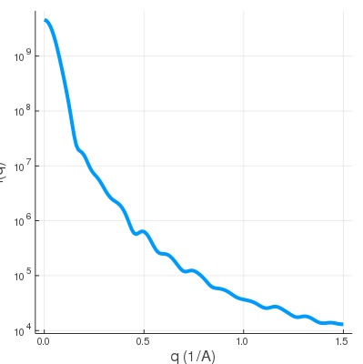

# SWAXS

SWAXS computes the solution x-ray scattering profiles from orientational average of molecules *in vitro* with incorporation of the following theories:
1. Spiral method for orientational average
2. Debye Formula
3. Theory of excessive electron densities
4. Solvent/ion shells
5. Excluded Volume
6. Bulk solvent estimation (*optional*)
7. Explicit solvent model or implicit solvent model
8. `q`-dependent atomic scattering form factor
9. Electron negativity in the `H-O-H` solvent molecules


## Notes

* This SWAXS program is written in Julia 1.6.0-DEV and built by *PackageCompiler.jl*
* SWAXS has 5 different computing modes for input files:

1. Single `.pdb` file
2. A pair of `.pdb` files: `solute.pdb` and `solvent.pdb` (used for buffer subtraction and excluded volume)
3. 3D electron density map: `.mrc` or `.map`. Buffer subtraction and excluded volume are implemented.
4. 3D shape with dummy voxels and customized uniform electron density: `.binvox`. Buffer subtraction is implemented.
5. The `DARE` mode with bulk solvent estimation from ` > 50` explicit solvent frames: `solute.pdb` and a directory `bulkdir` containing `prefix*.pdb` files.

* By default, SWAXS uses all cores of the CPU and can be scaled for larger workstation and cluster.


## Version

Run `.\bin\SWAXS --version`

```
>.\bin\SWAXS --version
0.3.1
```

## Usage

Run `.\bin\SWAXS --help`

```
>.\\bin\\SWAXS --help

usage: SWAXS [-D DENSITY] [-s SOLVENT_DENSITY] [-c DENSITY_CUTOFF]
             [-P PDB] [-T SOLUTE] [-V SOLVENT] [-b BULKDIR]
             [-e ENVELOPE] [-p PREFIX] [--dare] [-B BINVOX]
             [-v VOXEL_DENSITY] [-J J] [-n NPR] [-o OUTPUT]
             [--version] [-h] qmin qspacing qmax

Small and Wide-Angle X-ray Scattering calculator for (a) single atomic
coordinates: .pdb, (b) solute-solvent PDB pair for buffer subtraction,
(c) electron density: .mrc or .map with implicit density model, (d)
voxelized 3D shape: .binvox with uniform excessive electron density
and (f) DARE mode for accurate bulk solvent modeling. SWAXS implements
the Debye formula, orientational average and theory of excessive
electron density to account for buffer subtraction, solvent shell and
excluded volumes.

positional arguments:
  qmin                  Starting q value, in (1/A) (type: Float64)
  qspacing              q grid spacing, in (1/A) (type: Float64)
  qmax                  Ending q value, in (1/A) (type: Float64)

optional arguments:
  -D, --density DENSITY
                        CCP4 electron density map file: .mrc or .map
  -s, --solvent_density SOLVENT_DENSITY
                        The bulk solvent electron density in e/A^3
                        (type: Float64, default: 0.335)
  -c, --density_cutoff DENSITY_CUTOFF
                        The electron density cutoff to exclude
                        near-zero voxels (type: Float64, default:
                        0.001)
  -P, --pdb PDB         Single file containing atomic coordinates:
                        .pdb
  -T, --solute SOLUTE   The solute.pdb file containing atomic
                        coordinates of molecules, ions and solvents
  -V, --solvent SOLVENT
                        The solvent.pdb file containing atomic
                        coordinates of randomized bulk solvents
  -b, --bulkdir BULKDIR
                        The directory containing bulk frames; more
                        than 50 frames are suggested or use --solute
                        and --solvent
  -e, --envelope ENVELOPE
                        Distance between the envelope and molecular
                        surface, i.e. solvent layer width (type:
                        Float64, default: 10.0)
  -p, --prefix PREFIX   The .pdb file prefix in the --bulkdir
                        (default: "bulk")
  --dare                Make sure that you're actually doing it!!
                        Computing cluster suggested.
  -B, --binvox BINVOX   The shape file of dummy voxels: .binvox
  -v, --voxel_density VOXEL_DENSITY
                        The averaged electron density on dummy voxels
                        in e/A^3 (type: Float64, default: 0.5)
  -J, --J J             Number of orientations to be averaged (type:
                        Int64, default: 1200)
  -n, --npr NPR         Number of parallel workers for computation
                        (type: Int64, default: 4)
  -o, --output OUTPUT   Output file prefix for saving the .dat file
                        (default: "output")
  --version             show version information and exit
  -h, --help            show this help message and exit

===================================================================
===             Last Update: 08/10/20, Ithaca, NY.              ===
===           Copyright (c) Yen-Lin Chen, 2018 - 2020           ===
===                Academic Free License v. 3.0                 ===
===                 Email: yc2253@cornell.edu                   ===
===================================================================

```


## Examples

### Mode 1. Single `.pdb` file: `.\test\rna.pdb`

- The `.\test\rna.pdb` file contains about 750 atoms of short RNA duplex *in vacuo*.
- Required argument(s): `--pdb`

Run

```
.\bin\SWAXS --pdb ".\\test\\rna.pdb" -o test -J 1500 0.0 0.1 1.0
```

The output should look like

```
[ Info: --- SWAXS: Setting up parallel workers ...
[ Info: --- SWAXS: Please wait ...
[ Info: --- SWAXS: Computing SWAXS (J=1500) using single PDB file: .\\test\\rna.pdb.
[ Info: --- SWAXS: Starting Time: 2020-08-10T01:29:57.379 ...
[ Info: --- SWAXS: SWAXS program completed successfully: elapsed time = 17.63 seconds with 4 cores.
[ Info: --- SWAXS: Removing parallel workers ...
```

And the swaxs profile from `q = 0.0` to `q = 1.0` with spacing `0.1` is saved as `test.dat`.

rna.pdb                    |  SWAXS profile
:-------------------------:|:-------------------------:
               |  


### Mode 2. `.pdb` pair: `solute.pdb` and `solvent.pdb`

- Each of the `.pdb` file contains about 9000 atoms. The `solvent.pdb` is needed for buffer subtraction.
- Required argument(s): `--solute`, `--solvent`

Run

```
.\bin\SWAXS --solute ".\\test\\solute.pdb" --solvent ".\\test\\solvent.pdb" -o test 0.0 0.1 1.0
```

The output should look like

```
[ Info: --- SWAXS: Setting up parallel workers ...
[ Info: --- SWAXS: Please wait ...
[ Info: --- SWAXS: Processing solvent ...
[ Info: --- SWAXS: Computing SWAXS (J=1200) using solute: .\\test\\solute.pdb and solvent: .\\test\\solvent.pdb.
[ Info: --- SWAXS: Starting Time: 2020-08-10T01:38:43.683 ...
[ Info: --- SWAXS: SWAXS program completed successfully: elapsed time = 44.16 seconds with 4 cores.
[ Info: --- SWAXS: Removing parallel workers ...
```

And the swaxs profile from `q = 0.0` to `q = 1.0` with spacing `0.1` is saved as `test.dat`.

solute.pdb                 |  solvent.pdb              |  SWAXS profile
:-------------------------:|:-------------------------:|:-------------------------:
            |           |  


### Mode 3. CCP4 3D electron density `.mrc` or `.map` file: `dna1.mrc`

- The `dna1.mrc` contains 96x96x96 volumetric data and is considered to be the *excessive* density on top of the uniform electron density in the solvent background.
- Required argument(s): `--density`, `--solvent_density` (the density for solvent background in `e/A^3`), `--density_cutoff` (the voxels beyond which are considered bulk-like)

Run

```
.\bin\SWAXS --density ".\\test\\dna1.mrc" -s 0.335 -c 0.001 -o test 0.0 0.1 1.0
```

The output should look like

```
[ Info: --- SWAXS: Setting up parallel workers ...
[ Info: --- SWAXS: Please wait ...
[ Info: --- SWAXS: Computing SWAXS (J=1200) using electron density file: .\\test\\dna1.mrc, with sden=0.335 cutoff=0.001.
[ Info: --- SWAXS: Starting Time: 2020-08-10T01:44:05.783 ...
[ Info: --- SWAXS: SWAXS program completed successfully: elapsed time = 24.28 seconds with 4 cores.
[ Info: --- SWAXS: Removing parallel workers ...
```

And the swaxs profile from `q = 0.0` to `q = 1.0` with spacing `0.1` is saved as `test.dat`.

dna1.mrc                  |  SWAXS profile
:-------------------------:|:-------------------------:
             |  

The `dna1.mrc` is just an envelope, so it doesn't have much feature in the WAXS regime.


shape2.mrc                 |  SWAXS profile
:-------------------------:|:-------------------------:
            |  

The `shape2.mrc` has more features, reflected in the wide-angle regime.

Note that this is just a demonstration and in this case, it's advised to have well-defined molecular support (not yet integrated in this SWAXS version.).


### Mode 4. 3D dummy voxels: `rabbit.binvox`

- The `rabbit.binvox` contains 51x51x51 volumetric data with a grid size of `2A` and is considered to be the 3D cat shape with *Excessive* Density `1.0 e/A^3`.
- Required argument(s): `--binvox`, `--solvent_density` (see above), `--voxel_density` (The uniform density on each voxel)

Run

```
.\bin\SWAXS --binvox ".\\test\\rabbit.binvox" -s 0.335 -v 1.0 -o test 0.0 0.1 1.0
```

The output should look like

```
[ Info: --- SWAXS: Setting up parallel workers ...
[ Info: --- SWAXS: Computing SWAXS (J=1200) using shape file: .\\test\\rabbit.binvox, with voxel_density=1.0, sden=0.335.
[ Info: --- SWAXS: Starting Time: 2020-08-09T23:16:16.447 ...
[ Info: --- SWAXS: SWAXS program completed successfully: elapsed time = 17.65 seconds with 4 cores.
[ Info: --- SWAXS: Removing parallel workers ...
```

And the swaxs profile from `q = 0.0` to `q = 1.0` with spacing `0.01` is saved as `test.dat`.

rabbit.binvox              |  SWAXS profile
:-------------------------:|:-------------------------:
            |  

This uniform 3D voxelized shape is very similar to the `shape.mrc` case since the electron density is uniform within the rabbit. So SWAXS profile at wide-angle regime actually reveals finer periodicity from electron-denser structures.


### DARE Mode: `.\\test\\solvent`

- The `.\\test\\solvent` contains the solute file `solute.pdb` and solvent frames from bulk MD simulations `frame*.pdb` for estimation of bulk solvent density.
- In this case, all the solvent frames have the filename prefix of `frame`.
- More than 50 frames of random bulk solvent should be included.
- **DARE mode requires computing cluster.**
- Required argument(s): `--bulkdir`, `--prefix`, `--solute`, `--dare`
- The `--envelope` argument is optional with default of `10.0 A` to include solvent and ion shells.

Run

```
.\bin\SWAXS --dare --bulkdir ".\\test\\solvent" --prefix frame --solute ".\\test\\solvent\\solute.pdb" --envelope 10.5 -J 800 -o test 0.0 0.1 1.0
```

The output should look like

```
[ Info: --- SWAXS: Setting up parallel workers ...
[ Info: --- SWAXS: DARE mode ...
[ Info: --- SWAXS: Processing bulk solvents ...
[ Info:            -- Estimating solvent density using frame1.pdb ...
[ Info:            -- Estimating solvent density using frame3.pdb ...
[ Info:            -- Estimating solvent density using frame2.pdb ...
[ Info: --- SWAXS: Computing SWAXS (J=800) in DARE mode ...
[ Info: --- SWAXS: Starting Time: 2020-08-09T17:16:03.192 ...
[ Info: --- SWAXS: SWAXS program completed successfully: elapsed time = 483.1 seconds with 4 cores.
[ Info: --- SWAXS: Removing parallel workers ...
```

And the swaxs profile from `q = 0.0` to `q = 1.0` with spacing `0.1` is saved as `test.dat`.


## More Notes

1. The options `--pdb`, `--density`, `--binvox`, `--solute --solvent` and `--dare` cannot not be specified at the same time. Otherwise, error will be thrown.
2. If high-throughput computation is required, one should bypassing the command-line because it sets up parallel workers everytime. To avoid that, set up your parallel workers and call `@everywhere include("SWAXS.jl")` and `@everywhere using .SWAXS` in the julia script.
3. The `--dare` mode is very expensive and should not be used for high-throughput computation unless on cluster.


## References
1. Park, S. Simulated x-ray scattering of protein solutions using explicit-solvent models. *The Journal of Chemical Physics* 2009, 130, 134114
2. Cromer, D.T. and Mann, J.B. X-ray  scattering  factors  computed  from  numerical Hartree–Fock wave functions. *Acta Crystallographica Section A* 1968, 24, 321–324
3. Sorenson, J.M., Hura, G., Glaeser, R.M. and Head-Gordon, T. What can x-ray scattering tell us about the radial distribution functions of water? *The Journal of Chemical Physics* 2000, 113, 9149–9161
4. Ponti, A. Simulation of Magnetic Resonance Static Powder Lineshapes: A Quantitative Assessment of Spherical Codes. *Journal of Magnetic Resonance* 1999, 138, 288–297


## Applications
1. **Chen, YL.** et al., Salt Dependence of A-Form RNA Duplexes: Structures and Implications. *J. Phys. Chem. B* 2019, 123, 46, 9773-9785
2. **Chen, YL.** et al., Machine learning deciphers structural features of RNA duplexes measured with solution X-ray scattering. *IUCrJ* 2020, 7, *accepted*
3. He, W., **Chen, YL.** et al. *in preparation*
4. **Chen, YL.** et al. On SARS-Cov-2 secondary structures. *in preparation*
5. **Chen, YL.** et al. *In vitro* electron refinement. *in preparation*


## License

Academic Free License v. 3.0

## Copyright

(c) Yen-Lin Chen, 2018 - 2020
