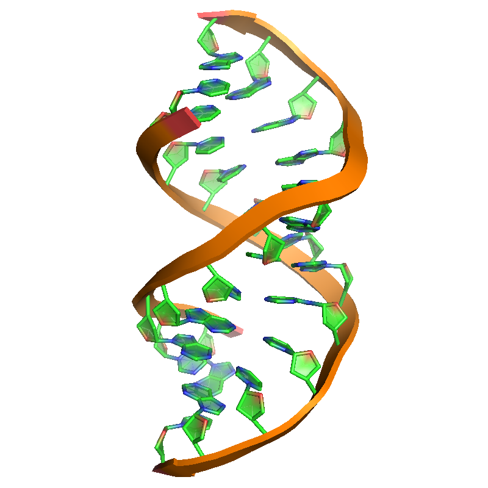
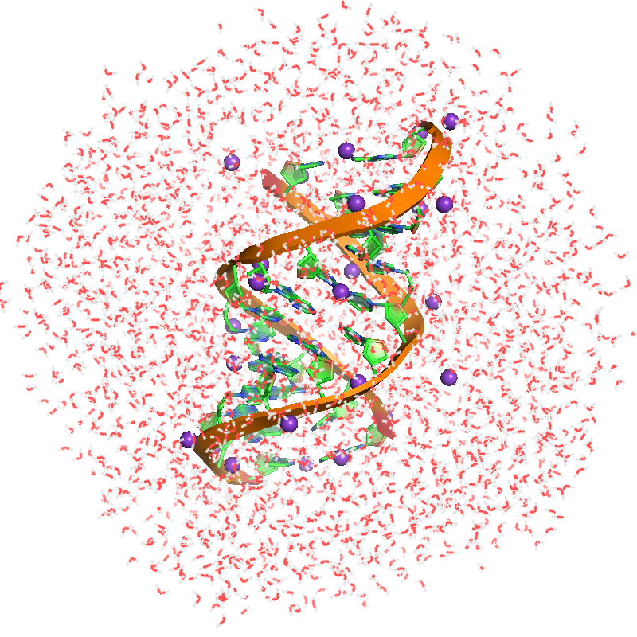
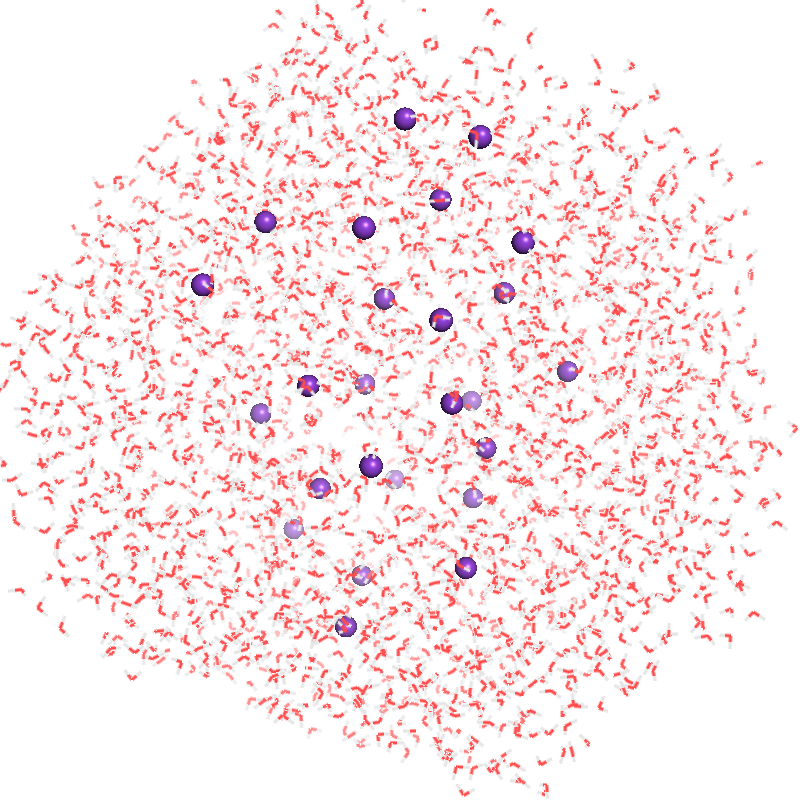
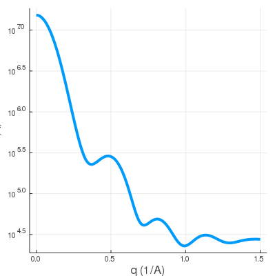

# SWAXS
Calculator for Small- and Wide-Angle X-ray Scattering profile.


## Notes

* This SWAXS program is written and built in Julia 1.5.0-DEV.
* SWAXS has 4 different computing modes for input files:

  1. Single `.pdb` file
  2. A pair of `.pdb` files: `solute.pdb` and `solvent.pdb` (used for buffer subtraction and excluded volume)
  3. 3D electron density map: `.mrc` or `.map`. Buffer subtraction is implemented.
  4. 3D shape with dummy voxels: `.binvox`. Buffer subtraction is implemented.

* By default, SWAXS uses 8 cores of the CPU and can be scaled for larger workstation and cluster.


## Version

Run `.\\bin\\SWAXS --version`

```
>.\\bin\\SWAXS --version
0.2.0
```

## Usage

Run `.\\bin\\SWAXS --help`

```
>.\\bin\\SWAXS --help
usage: SWAXS [-D DENSITY] [-P PDB] [-T SOLUTE] [-V SOLVENT]
             [-B BINVOX] [-s SOLVENT_DENSITY] [-v VOXEL_DENSITY]
             [-c DENSITY_CUTOFF] [-J J] [-n NPR] [-o OUTPUT]
             [--version] [-h] qmin qspacing qmax

Small and Wide-Angle X-ray Scattering calculator for single atomic
coordinates: .pdb, solute-solvent pair PDBs, electron density: .mrc or
.map and voxelized 3D shape: .binvox. SWAXS uses Debye formula,
orientational average and Park et al. to account for buffer
subtraction and solvent shell.

positional arguments:
  qmin                  Starting q value, in (1/A) (type: Float64)
  qspacing              q grid spacing, in (1/A) (type: Float64)
  qmax                  Ending q value, in (1/A) (type: Float64)

optional arguments:
  -D, --density DENSITY
                        Electron density map file: .mrc or .map
  -P, --pdb PDB         Single file containing atomic coordinates:
                        .pdb
  -T, --solute SOLUTE   The solute.pdb file
  -V, --solvent SOLVENT
                        The solvent.pdb file
  -B, --binvox BINVOX   The shape file of dummy voxels: .binvox
  -s, --solvent_density SOLVENT_DENSITY
                        The bulk solvent electron density in e/A^3
                        (type: Float64, default: 0.335)
  -v, --voxel_density VOXEL_DENSITY
                        The averaged electron density on dummy voxels
                        in e/A^3 (type: Float64, default: 0.5)
  -c, --density_cutoff DENSITY_CUTOFF
                        The electron density cutoff to exclude
                        near-zero voxels (type: Float64, default:
                        0.001)
  -J, --J J             Number of orientations to be averaged (type:
                        Int64, default: 1200)
  -n, --npr NPR         Number of parallel workers for computation
                        (type: Int64, default: 8)
  -o, --output OUTPUT   Output file prefix for saving the .dat file
                        (default: "output")
  --version             show version information and exit
  -h, --help            show this help message and exit

==============================================
Last updated: 03/10/20, Ithaca, NY.
Copyright (c) Yen-Lin Chen, 2018 - 2020
Email: yc2253@cornell.edu
==============================================
```


### 1. Calculating from single `.pdb` file containing atomic-coordinates: `rna.pdb`

   The `rna.pdb` file contains about 770 atoms.

```
>.\\bin\\SWAXS --pdb rna.pdb -o test 0.0 0.01 1.5
[ Info: --- SWAXS: Setting up parallel workers ...
[ Info: --- SWAXS: Please wait ...
[ Info: --- SWAXS: Computing SWAXS (J=1200) using single PDB file: rna.pdb.
[ Info: --- SWAXS: SWAXS program completed successfully: elapsed time = 10.169479699 seconds with 8 cores.
[ Info: --- SWAXS: Removing parallel workers ...
```

   And the swaxs profile from `q = 0.0` to `q = 1.5` with spacing `0.01` is saved as `test.dat`.

rna.pdb                    |  SWAXS profile
:-------------------------:|:-------------------------:
               |  


### 2. Calculating from a pair of `.pdb` files to account for buffer subtraction: `solute.pdb` and `solvent.pdb`

   Each of the `.pdb` file contains about 9000 atoms.

```
>.\\bin\\SWAXS --solute solute.pdb --solvent solvent.pdb -o test 0.0 0.01 1.5
[ Info: --- SWAXS: Setting up parallel workers ...
[ Info: --- SWAXS: Please wait ...
[ Info: --- SWAXS: Computing SWAXS (J=1200) using solute: solute.pdb and solvent: solvent.pdb.
[ Info: --- SWAXS: SWAXS program completed successfully: elapsed time = 38.712813001 seconds with 8 cores.
[ Info: --- SWAXS: Removing parallel workers ...
```

  And the swaxs profile from `q = 0.0` to `q = 1.5` with spacing `0.01` is saved as `test.dat`.

  solute.pdb                 |  solvent.pdb              |  SWAXS profile
  :-------------------------:|:-------------------------:|:-------------------------:
              |           |  

  Note that this is just for demonstration so the solvent/ion coordinates are exactly the same (i.e. the ion/solvent shells are still shaped by the molecule). However, it's suggested to use another frame of randomized solvent for a more precise buffer subtraction.
